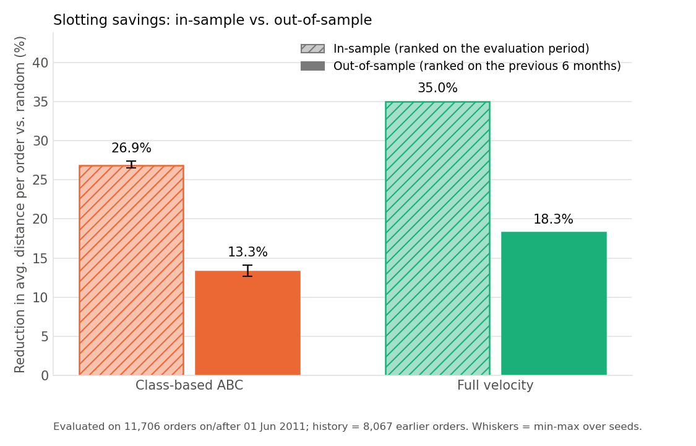
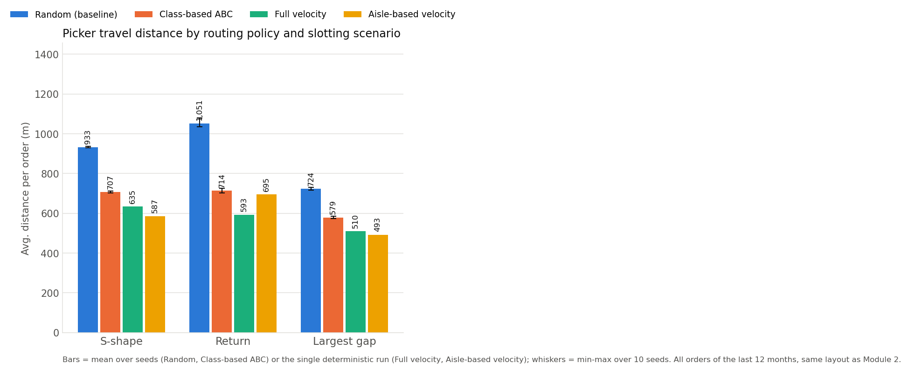
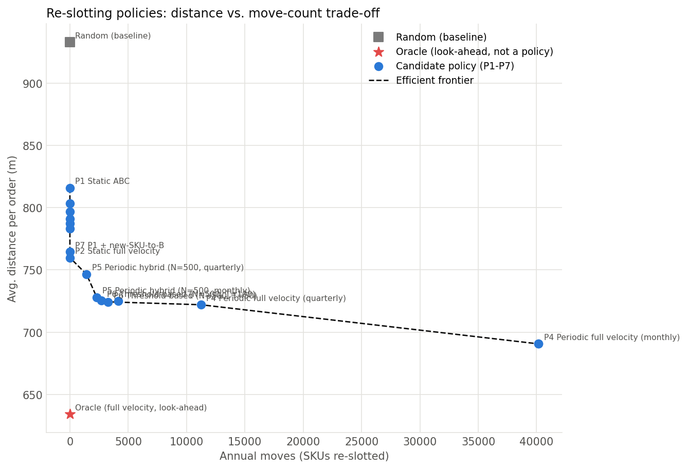
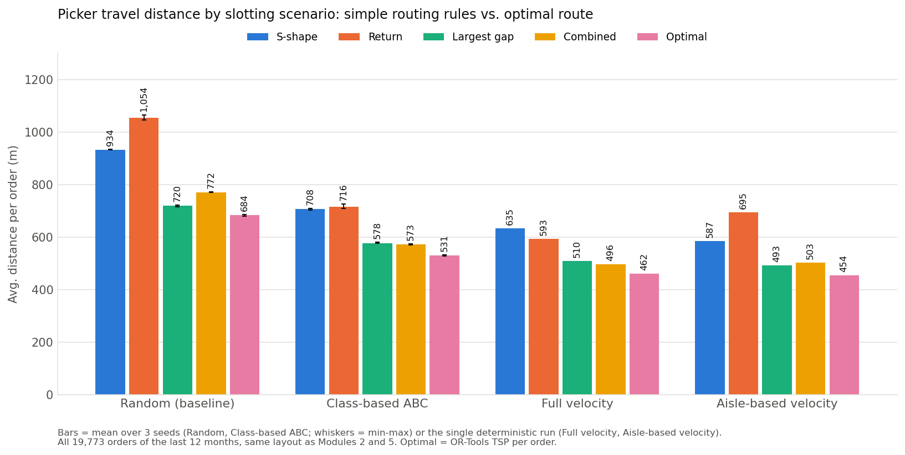
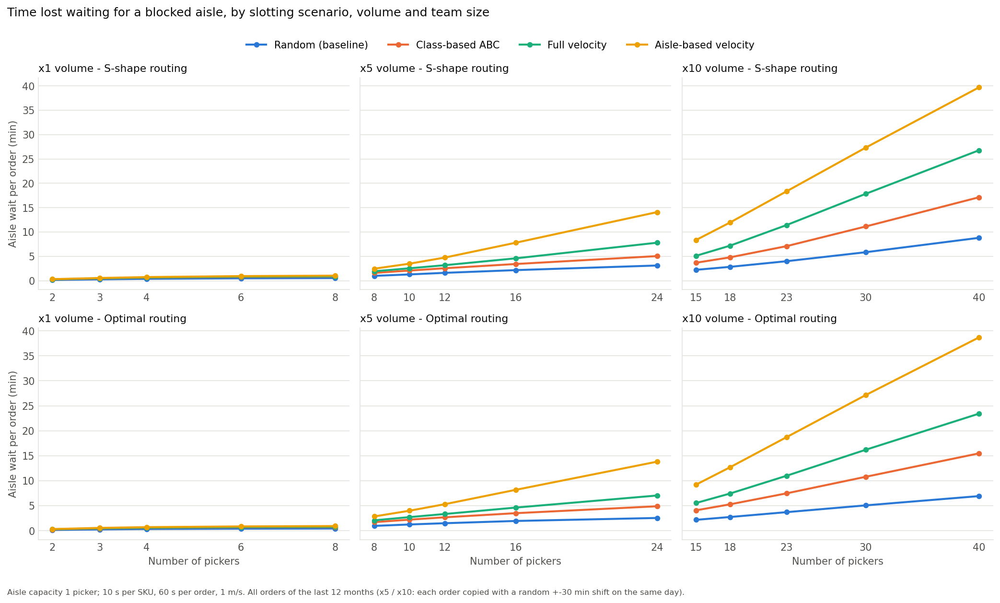
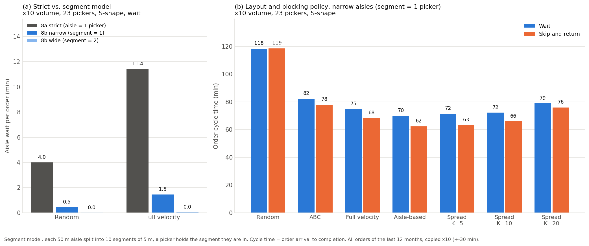
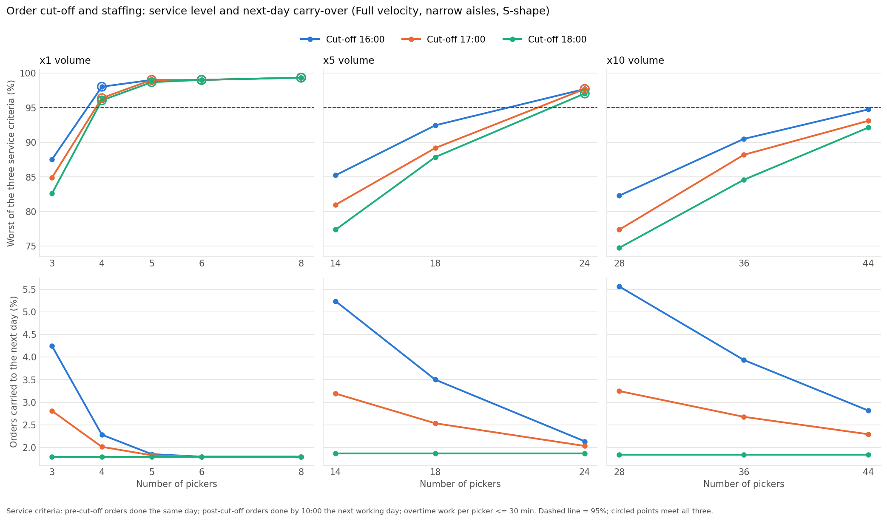

# Warehouse Slotting & Picking Optimization

> End-to-end warehouse picking analysis on real order data: velocity-based slotting, picker routing (simple rules vs. optimal), re-slotting policies and a multi-picker congestion simulation.

  

## TL;DR

- **Problem:** How much picker walking can be saved by storing frequently picked SKUs closer to dispatch? Real orders (19,773 orders, 3,791 SKUs, UCI Online Retail II) routed through a synthetic 40-aisle warehouse.
- **Result:** -24% (class-based ABC) to -32% (full velocity) vs. a random layout in-sample; **-13% to -19%** when SKUs are ranked on the prior year and evaluated on the next. Most of that gap comes from new SKUs with no pick history.
- **Recommendation:** ABC zoning with new SKUs placed at the front of the B zone (zero moves, 816 -> 764 m per order). If moving a SKU takes under ~4 minutes, also re-slot only the fastest 500 SKUs when their rank drifts (~10 moves per working day, 725 m per order).
- **Routing is a separate lever of similar size, with no SKU moves:** on the ABC layout, optimal routing instead of S-shape cuts walking by 25% (708 -> 531 m per order), and the best simple routing rule (Largest gap or Combined) is only 4-8% longer than optimal. In-sample figures (Module 7).
- **Scaling up (Modules 8a-8b, simulation of a picker team):** aisle congestion costs under 7% of work time at today's volume. At 10x volume, a strict "one picker per aisle" model says fast movers up front backfire, but with realistic 5 m aisle segments they keep their lead (23 pickers: 70-75 min from order to picked vs. 118 min for a random layout). Spreading fast movers over more aisles does not pay; in narrow aisles a simple skip-and-return rule cuts aisle waiting by about 40% on ABC and velocity layouts.
- **Order cut-off (Module 8c):** with an 18:00 order cut-off, 4 pickers instead of 6 meet the service level at today's volume (-33% cost per order).

## Business Problem

In a warehouse with thousands of SKUs, most of a picker's time is spent **walking**, not picking. If fast-moving items are stored far from the dispatch area, every order costs extra travel time and labour.

**Question:** How much can picker travel distance be reduced by re-slotting SKUs based on how often they are picked?

## Order Profile (Module 1)

- 33.6% of SKUs generate 80% of pick lines. 28.7% of SKUs land in a different ABC class by revenue than by pick frequency.
- 7.6% of orders have a single line; the median order has 15 lines.


## Key Results (Modules 2 & 3)

Real orders (UCI Online Retail II, last 12 months: 19,773 orders, 3,791 SKUs) routed with the S-shape heuristic through a synthetic 40-aisle warehouse.

| Scenario | Avg. distance per order | Total annual distance | Change vs. random | Est. walking time¹ | Picks from nearest 20% of slots |
|---|---|---|---|---|---|
| Random (baseline)² | 933 m | 18,449 km | – | 5,125 h | 20.2% |
| Class-based ABC² | 707 m | 13,973 km | **-24.3%** | 3,882 h | 49.9% |
| Full velocity | 635 m | 12,547 km | **-32.0%** | 3,485 h | 65.3% |

¹ Total distance at an assumed walking speed of 1.0 m/s; walking only, no picking or handling time.
² Mean of 10 random seeds. Range across seeds: random 930-936 m per order, class-based 703-711 m.

- **Class-based ABC captures about three quarters of the full-velocity saving** with only three zones, which is why it is the more practical option in a real warehouse.
- Orders are large (mean 26 lines, median 15), so picks still spread over many aisles even after re-slotting; this limits the achievable saving.
- Slotting was ranked and evaluated on the same 12 months, so these figures are an upper bound for future orders (see the out-of-sample check below).


Module 3 – Full tables: `reports/kpi_summary.xlsx` (KPI summary, assumptions, slot assignment of the 100 fastest SKUs).

### Out-of-sample check (Module 4)

The table above ranks SKUs with the same orders it evaluates. Module 4 checks how much of the saving survives when SKUs are ranked on *earlier* orders only, on two independent splits (same layout and S-shape routing in both):

- **6+6 months** (within the last 12 months): rank on Dec 2010 - May 2011 (8,067 orders), evaluate on Jun - Dec 2011 (11,706 orders). Unequal halves; the evaluation half includes the autumn peak.
- **Year-over-year**: rank on the whole prior year, 1 Dec 2009 - 30 Nov 2010 (19,743 orders), evaluate on the whole following year, 1 Dec 2010 - 30 Nov 2011 (18,957 orders) - two equal, non-overlapping 12-month windows. Only SKUs actually picked in the evaluated year are slotted (3,789 SKUs, still under the 4,000-slot layout). The two source sheets share an exact 9-day overlap at their boundary (21,932 duplicate rows / 830 invoices), which is detected and removed before the split.

| Scenario | Split | In-sample reduction | Out-of-sample reduction |
|---|---|---|---|
| Class-based ABC | 6+6 months | -26.9% | **-13.3%** |
| Class-based ABC | Year-over-year | -24.4% | **-12.6%** |
| Full velocity | 6+6 months | -35.0% | **-18.3%** |
| Full velocity | Year-over-year | -32.0% | **-18.6%** |

The two splits - built from non-overlapping years of data - agree closely (class-based -13.3% vs. -12.6%; full velocity -18.3% vs. -18.6%). **The year-over-year split is used as the primary out-of-sample estimate**, because it compares two equal 12-month windows (no seasonal imbalance between the ranking and evaluation periods) and matches how a warehouse would actually re-slot - once a year, on the prior year's data. The 6+6 split is a robustness check and reaches the same conclusion.

**Where does the rest of the in-sample saving go?** Each out-of-sample scenario was evaluated a second time, excluding visits to SKUs never picked in the ranking period ("seen-only visits"), against its own random baseline computed the same way:

| Scenario | Split | Reduction, all visits | Reduction, seen-only visits | New-SKU effect |
|---|---|---|---|---|
| Class-based ABC | 6+6 months | -13.3% | -23.8% | 10.5 pp |
| Class-based ABC | Year-over-year | -12.6% | -23.8% | 11.3 pp |
| Full velocity | 6+6 months | -18.3% | -31.4% | 13.1 pp |
| Full velocity | Year-over-year | -18.6% | -31.9% | 13.3 pp |

- SKUs with no pick history in the ranking period (514 of 3,791 SKUs / 16.2% of visits, 6+6; 651 of 3,789 SKUs / 18.7% of visits, year-over-year) are ranked last by construction. Excluding their visits recovers most of the in-sample saving: seen-only reductions (23.8-31.9%) sit close to the in-sample figures (24.4-35.0%).
- So **10-13 percentage points of the out-of-sample gap is specifically the cost of slotting items with no pick history**; the remaining 1-4 points is ordinary pick-frequency drift among SKUs that were already known.
- Practically, this argues for a new-SKU policy (provisional slotting from a category/supplier proxy, then a fast re-check after the first weeks of sales) rather than against velocity-based slotting itself.



### Routing sensitivity (Module 5)

Everything above assumes **S-shape** routing (every aisle with a pick is walked end to end). Module 5 asks: **does the best slotting method change with the routing policy?** It adds two more routing heuristics - **Return** (every aisle is entered from the front and left the way it came, never traversed end to end) and **Largest gap** (the first and last aisle are traversed end to end; every aisle between them skips its single largest unpicked gap, entered from both ends) - and a 4th, simpler slotting rule, **Aisle-based velocity** (the fastest SKUs fill the nearest aisle completely before moving to the next, rather than being ranked by exact walking distance). All 19,773 orders of the last 12 months, same layout as above.

| Routing policy | Random | Class-based ABC | Full velocity | Aisle-based velocity |
|---|---|---|---|---|
| S-shape | 933 m | 707 m (-24.3%) | 635 m (-32.0%) | **587 m (-37.1%)** |
| Return | 1,051 m | 714 m (-32.0%) | **593 m (-43.6%)** | 695 m (-33.9%) |
| Largest gap | 724 m | 579 m (-20.0%) | 510 m (-29.6%) | **493 m (-31.9%)** |

*(% = reduction vs. the random baseline of the same routing policy - absolute distances are not comparable across policies. Bold = shortest non-random scenario per row.)*



- **Yes, the best-performing scenario changes with the routing policy.** Aisle-based velocity is shortest under S-shape and Largest gap; Full velocity is shortest under Return (where Aisle-based velocity is worse than Full velocity, but still beats Class-based ABC).
- **Why:** S-shape and Largest gap charge a cost per aisle visited that is close to fixed (a full traversal, or up to the largest gap) almost regardless of pick depth, so minimising the *number of aisles touched* - what Aisle-based velocity does by packing fast SKUs into complete aisles - matters more than minimising raw walking distance. Return's cost is a direct there-and-back distance to each pick, exactly what Full velocity's ranking (straight-line distance from the depot) is built to minimise.
- **Class-based ABC stays a robust middle choice under all three policies** (-20.0% to -32.0% vs. random) - this is why the recommendation above does not depend on knowing which routing heuristic a real warehouse uses. The choice between the two more precise methods (Full velocity vs. Aisle-based velocity) does depend on it: prefer Full velocity if pickers tend to backtrack (Return-like), Aisle-based velocity - a simpler rule than a full distance ranking - if they loop through aisles (S-shape/Largest-gap-like).

### Re-slotting policies (Module 6)

Every result above compares one-time layouts. Real warehouses keep operating while pick frequencies drift, so re-slotting has a recurring cost: every SKU that changes slot has to be physically moved. Module 6 simulates a full evaluation year (Dec 2010 - Nov 2011, Module 4's year-over-year setup) month by month, updating each policy's layout using only a rolling 12-month window of data available *as of* that month (no look-ahead), and counts how many SKUs move at each update.

| Policy | Params | Avg. distance/order | Annual moves | Total h/year @ 2 min/move | @ 5 min/move | @ 10 min/move |
|---|---|---|---|---|---|---|
| Random (baseline) | – | 933 m | 0 | 4,913 | 4,913 | 4,913 |
| Oracle (look-ahead)¹ | – | 634 m | 0 | 3,340 | 3,340 | 3,340 |
| P1 Static ABC | – | 816 m | 0 | 4,296 | 4,296 | 4,296 |
| P2 Static full velocity | – | 760 m | 0 | 4,001 | **4,001** | **4,001** |
| P3 Hybrid static | N=500 (best of 50-500) | 783 m | 0 | 4,124 | 4,124 | 4,124 |
| P4 Periodic full velocity | monthly | 691 m | 40,161 | 4,975 | 6,983 | 10,330 |
| P4 Periodic full velocity | quarterly | 722 m | 11,232 | 4,176 | 4,738 | 5,674 |
| P5 Periodic hybrid | N=500, monthly | 728 m | 2,300 | 3,911 | 4,026 | 4,217 |
| P5 Periodic hybrid | N=500, quarterly | 747 m | 1,419 | 3,979 | 4,050 | 4,168 |
| P6 Threshold-based | N=500, T=25 | 725 m | 4,131 | 3,955 | 4,161 | 4,506 |
| P6 Threshold-based | N=500, T=50 | 724 m | 3,274 | 3,923 | 4,087 | 4,360 |
| P6 Threshold-based | N=500, T=100 | 725 m | 2,706 | **3,910** | 4,046 | 4,271 |
| P7 P1 + new-SKU-to-B | – | 764 m | 0 | 4,025 | 4,025 | 4,025 |

¹ Oracle ranks SKUs on the evaluation year itself, which requires foresight; shown as an upper bound, not a candidate policy. Bold = cheapest policy per move-cost column.



**Does the best policy change with the assumed move cost, and how sensitive is the answer?** Yes, and the crossover is precise: **P6 (threshold-based, N=500, T=100)** and **P5 (periodic hybrid, N=500, monthly)** are in a practical tie for cheapest at 2 minutes/move (3,910 h vs. 3,911 h/year); **P2 (static full velocity, never updated)** overtakes both once a move costs more than about **4.0-4.4 minutes** of labour - below that, a small number of well-targeted moves (2,300-2,706/year - 93-94% fewer than P4's 40,161 full monthly re-rank) pays for itself; above it, doing nothing after the initial ranking wins.

- **Base, always worth doing:** ABC zoning with new SKUs placed at the front of the B zone rather than the back (P7, P1's rule) cuts plain static ABC (P1, 816 m) to 764 m for zero ongoing moves - a free improvement regardless of how expensive a move is.
- **If moves are cheap (well under ~4 min/SKU), add a throttled layer on top:** the threshold-based hybrid (P6, N=500, T=100 - the fastest 500 SKUs individually sequenced, the rest zoned A/B/C, moved only on a class change or a >100-position rank drift, checked monthly) reaches 725 m for about 2,706 moves/year (roughly 10 a working day) - P5's monthly variant lands in a practical tie.
- **If moves are expensive, skip the throttled layer:** a one-time full-velocity ranking (P2), never updated again, reaches 760 m at zero ongoing moves - cheaper overall than paying for any of the throttled hybrids' moves once a move costs much more than ~4 minutes.
- **The ~4-minute crossover is an assumption, not a law:** it comes from 1.0 m/s walking and counting only walking time. Product size and rack-capacity limits are not modelled here, and an ABC-zoned layout tends to absorb those real constraints (heavy or bulky items, minimum/maximum rack sizes) more flexibly than an individually sequenced full-velocity ranking - a reason to lean towards the ABC-based options even near the crossover.
- **Full monthly re-ranking (P4) is never worth it in this cost range**: even at 2 minutes/move it costs 4,975 h/year (worse than every other candidate), because strict individual velocity ranking reshuffles most of the catalogue's long tail every month (40,161 moves/year, ~96% of SKUs on average) from small frequency ties shifting - a known weakness of ranking every SKU individually rather than in zones.
- N=500 was the best of the tested grid {50, 100, 200, 300, 500} for both the static hybrid (P3) and the N reused by P5/P6 - the improvement was still increasing at N=500, so a larger N might do even better; this was not tested (see methodology).

### Optimal routing (Module 7)

Modules 2-6 route orders with simple rules. Module 7 asks **how far those rules are from the shortest possible route, and whether the best slotting method changes once routing is optimal.** The warehouse is modelled as a graph (same 40-aisle layout; nodes = depot, pick locations and aisle ends; edges = aisle segments and the front/back cross aisles). Every order is solved as a travelling-salesman problem with Google OR-Tools. A 5th rule is added, **Combined** (each aisle is either traversed end to end or entered and left from the same side, whichever is shorter, chosen by dynamic programming over the picker's side). All 19,773 orders; Random and Class-based ABC use **3 seeds** (0-2) instead of 10, because a 10-seed run did not fit the 30-minute budget (see methodology).

| Routing | Random | Class-based ABC | Full velocity | Aisle-based velocity |
|---|---|---|---|---|
| S-shape | 934 m | 708 m (-24.3%) | 635 m (-32.1%) | **587 m (-37.2%)** |
| Return | 1,054 m | 716 m (-32.1%) | **593 m (-43.8%)** | 695 m (-34.1%) |
| Largest gap | 720 m | 578 m (-19.7%) | 510 m (-29.2%) | **493 m (-31.6%)** |
| Combined | 772 m | 573 m (-25.7%) | **496 m (-35.7%)** | 503 m (-34.9%) |
| **Optimal** | 684 m | 531 m (-22.4%) | 462 m (-32.4%) | **454 m (-33.6%)** |

*(% = change vs. the random baseline of the same routing policy. Bold = shortest non-random scenario per row. Random and Class-based ABC: mean of 3 seeds, so their S-shape/Return/Largest-gap values differ slightly from the 10-seed Module 5 table above; the deterministic scenarios match it exactly.)*

**How much longer than optimal is each rule?** Per order, rule / optimal - 1, averaged over all orders (median in brackets):

| Routing | Random | Class-based ABC | Full velocity | Aisle-based velocity |
|---|---|---|---|---|
| S-shape | +34.7% (+36.7%) | +33.0% (+33.1%) | +41.6% (+38.2%) | +29.3% (+28.3%) |
| Return | +45.2% (+48.0%) | +28.9% (+29.5%) | +21.1% (+19.3%) | +44.9% (+46.8%) |
| Largest gap | **+4.4% (+3.0%)** | +8.7% (+7.0%) | +13.7% (+8.0%) | **+8.0% (+5.4%)** |
| Combined | +11.8% (+11.5%) | **+7.4% (+5.9%)** | **+6.5% (+4.5%)** | +10.4% (+8.5%) |



- **The best simple rule is 4-8% above optimal; S-shape and Return are 21-45% above it.** Largest gap or Combined, whichever suits the layout, recovers most of the achievable routing saving. S-shape - the rule behind Modules 2-4 and 6 - and Return make pickers walk 21-45% further than necessary.
- **Which simple rule comes closest depends on the layout.** Largest gap is closest on Random and Aisle-based velocity; Combined is closest on Class-based ABC and Full velocity, which put fast SKUs near the front of many aisles, where entering an aisle and backing out is cheap. Per order, Largest gap is strictly the shortest of the four rules in 55% of order x layout cases, Combined in 25% (ties for the rest; S-shape and Return are never strictly shortest).
- **With optimal routing the best slotting method is Aisle-based velocity (454 m), ahead of Full velocity (462 m, +1.8%)** - the same winner as under S-shape and Largest gap (Module 5), not the Return/Combined winner. Class-based ABC gains the least from its layout under optimal routing (-22.4% vs. random, against -32% to -34% for the two velocity methods), because a good route already removes much of the walking that zoning would save.
- **Routing and slotting are separate levers of similar size.** On the Class-based ABC layout, switching from S-shape to optimal routing cuts 708 m to 531 m (-25%), about the same as moving from a random layout to ABC zoning under S-shape (-24%). The two combine: Aisle-based velocity with optimal routing (454 m) is 51% below Random with S-shape (934 m).

### Multi-picker congestion (Module 8a)

*Strict model: a whole aisle holds one picker. Module 8b below refines this to 5 m aisle segments, which shrinks waiting about 8-9 times and reverses the growth conclusion at the end of this section.*

Every module above assumes one picker alone in the warehouse. Module 8a simulates a whole team (SimPy discrete-event simulation): orders drop into a FIFO queue at their real invoice time, idle pickers pull the next one, walk its route at 1 m/s, spend 10 s per SKU and 60 s per order on set-up and hand-over. **An aisle holds one picker at a time** - anyone else waits at the aisle end. Shift 08:00-18:00 (98% of orders arrive in that window); leftover work is finished as overtime. Volume x1 (the real year: 19,773 orders on 305 days), x5 and x10 (each order copied with a random +-30 min shift on the same day), 4 layouts (Random and Class-based ABC with one seed), S-shape and optimal routes (Module 7's OR-Tools tours, cached). Picker counts per volume: x1 2-8, x5 8-24, x10 15-40 (5 each; see methodology for how the ranges were chosen).

At a mid-range team size per volume (S-shape / optimal routing):

| Volume, pickers | Layout | Aisle wait per order | Waiting / work time | Order cycle time | Share of waiting in the 5 front aisles (S-shape) | Overtime per day (S-shape) |
|---|---|---|---|---|---|---|
| x1, 4 | Random | 0.4 / 0.3 min | 1.8% / 1.9% | 41 / 26 min | 13% | 1.6 h |
| x1, 4 | Class-based ABC | 0.6 / 0.5 min | 3.4% / 3.7% | 28 / 20 min | 31% | 0.9 h |
| x1, 4 | Full velocity | 0.6 / 0.6 min | 3.9% / 4.3% | 25 / 17 min | 54% | 0.8 h |
| x1, 4 | Aisle-based velocity | 0.7 / 0.7 min | 4.6% / 5.1% | 23 / 17 min | 65% | 0.7 h |
| x5, 12 | Random | 1.6 / 1.5 min | 7.1% / 8.1% | 124 / 76 min | 15% | 29.1 h |
| x5, 12 | Class-based ABC | 2.6 / 2.7 min | 12.9% / 15.8% | 93 / 66 min | 39% | 20.6 h |
| x5, 12 | Full velocity | 3.2 / 3.3 min | 16.6% / 20.3% | 88 / 63 min | 67% | 19.3 h |
| x5, 12 | Aisle-based velocity | 4.8 / 5.3 min | 23.9% / 29.1% | 97 / 81 min | 82% | 21.8 h |
| x10, 23 | Random | 4.0 / 3.7 min | 16.0% / 18.1% | 166 / 108 min | 17% | 83.6 h |
| x10, 23 | Class-based ABC | 7.1 / 7.5 min | 29.2% / 34.4% | 160 / 127 min | 48% | 80.2 h |
| x10, 23 | Full velocity | 11.4 / 11.0 min | 41.8% / 45.7% | 205 / 161 min | 85% | 109.5 h |
| x10, 23 | Aisle-based velocity | 18.4 / 18.7 min | 54.8% / 59.2% | 295 / 269 min | 94% | 172.1 h |

*Cycle time = order arrival to completion (queue + picking). All 128 simulated configurations, including overtime, utilisation and hourly throughput, are in `data/processed/congestion_simulation.csv`. Overtime = picker-hours per day spent on orders after 18:00 (Module 8b's definition), recomputed in Module 8c by re-simulating these configurations, which reproduced every other stored metric exactly. The overtime column in 8a's CSV uses 8a's original definition, which also counted idle evening time.*



**1. When does congestion start to matter?** Not at today's volume: at x1, waiting stays below 7% of work time (at most about 1 minute per order) even with 8 pickers. At x5 it is material from the smallest team tested for the velocity layouts (S-shape, 8 pickers: 11-14% of work time for Full and Aisle-based velocity, 8% for ABC, 4% for Random), and at x10 it is 10-42% of work time with 15 pickers and up to 75% with 40.

**2. Do velocity layouts pile traffic up at the front, and how much of the walking gain goes into waiting?** Yes. The 5 aisles nearest the depot hold 13-19% of all waiting under Random, 31-56% under ABC, 53-92% under Full velocity and 64-97% under Aisle-based velocity. Per order, the walking time saved vs. Random (no congestion) and what is left of it after aisle waits (S-shape route):

| Layout | Saving without congestion | x1, 4 pickers | x5, 12 pickers | x10, 23 pickers |
|---|---|---|---|---|
| Class-based ABC | 3.8 min | 3.6 min (6% lost) | 2.8 min (25% lost) | 0.7 min (82% lost) |
| Full velocity | 5.0 min | 4.8 min (5% lost) | 3.5 min (31% lost) | **-2.4 min** (slower than Random) |
| Aisle-based velocity | 5.8 min | 5.5 min (6% lost) | 2.7 min (54% lost) | **-8.5 min** (slower than Random) |

The cause is a hard bottleneck, not a staffing problem: under Aisle-based velocity the front aisle needs 16 hours of aisle time per 10-hour shift at x10 (Full velocity: 12 hours; ABC's busiest aisle: 9; Random's: 5), so adding pickers only lengthens the queue at that aisle.

**3. Is optimal routing hit harder by congestion than S-shape?** No. Aisle waits per order are about the same on both routes (within about 20%), and optimal routing has the shorter cycle time in every configuration. Its share of time spent waiting is higher only because its work time is shorter. Its per-order advantage over S-shape shrinks at moderate team sizes on front-loaded layouts (largest drop: Aisle-based velocity, x10, 15 pickers, 2.2 -> 1.4 min) and grows once aisles are saturated (Full velocity, x10, 40 pickers, 2.9 -> 6.2 min), because shorter visits free the blocked aisle sooner.

**4. How many pickers?** Defined as the smallest team size after which a 10% larger team cuts mean cycle time by less than 2.5% (cycle-time elasticity above -0.25 between neighbouring grid points):

| Volume | Random | Class-based ABC | Full velocity | Aisle-based velocity |
|---|---|---|---|---|
| x1 | 6 optimal / >=8 S-shape | 6 | 6 | 6 |
| x5 | >=24 | >=24 | >=24 | 16 (bottleneck) |
| x10 | >=40 | >=40 | 23 (bottleneck) | 15 (bottleneck) |

*">=": still improving at the largest team tested (thin grid, chosen for runtime). "Bottleneck": extra pickers stop helping because of the front-aisle limit, while cycle times stay at 1.1-1.3 hours (x5) and 2.7-5.3 hours (x10); the fix there is the layout, not the headcount.* At x1, 6 pickers give 14-25 min cycle times at 24-38% utilisation; 4 pickers already keep cycle times at 17-41 min.

**Sensitivity (x10, 23 pickers, Random and Full velocity):** the result hinges on aisle capacity. **With room for 2 pickers per aisle, waiting drops by 86-91%** (Full velocity, S-shape: 11.4 -> 1.5 min per order) and Full velocity beats Random again (cycle time 74 vs. 118 min). At 15 s per SKU, waiting grows (Full velocity, S-shape: 11.4 -> 15.7 min) and Random keeps its lead (208 vs. 294 min).

- **At today's volume the earlier conclusions hold:** congestion eats at most ~13% of the walking saving.
- **In a growing warehouse with narrow aisles,** concentrating fast movers at the front stops paying off somewhere between x5 and x10 volume; ABC zoning keeps most of its advantage longer, and wider aisles (2 pickers) restore the velocity layouts' lead.

### Refined congestion model (Module 8b)

Module 8a is the **strict model**: a whole 50 m aisle holds one picker. Module 8b makes it realistic: every aisle is split into **10 segments of 5 m**, and a picker only holds the segment they are walking or picking in (narrow aisle: 1 picker per segment; wide: 2). To rule out deadlocks, a blocked picker steps aside: they release their own segment before waiting for the next one, so two pickers can never hold each other up in a circle. It also adds a **Spread velocity** layout (the fastest SKUs dealt round-robin over the front of the first K aisles, K = 5, 10, 20), a **skip-and-return** policy (if the next aisle's entry segment is full when the picker is about to walk there, they do the following aisle first and come back), and a **cost-based team size**. Runtime limited the scope (chosen after a ~10 h estimate for the full grid): S-shape routing only; 44 configurations; all orders, no sampling.

**1. Strict vs. segment model** (x10 volume, 23 pickers, S-shape, wait):

| Layout | Model | Aisle wait per order | Waiting / work time | Order cycle time |
|---|---|---|---|---|
| Random | 8a strict (aisle = 1 picker) | 4.0 min | 16.0% | 166 min |
| Random | 8b narrow (segment = 1 picker) | 0.5 min | 2.1% | 118 min |
| Random | 8b wide (segment = 2 pickers) | 0.0 min | 0.0% | 113 min |
| Full velocity | 8a strict | 11.4 min | 41.8% | 205 min |
| Full velocity | 8b narrow | 1.5 min | 8.4% | **75 min** |
| Full velocity | 8b wide | 0.0 min | 0.2% | **58 min** |

**2-3. Spreading fast movers and skip-and-return** (x10 volume, 23 pickers, narrow aisles, S-shape):

| Layout | Walk per order | Aisle wait, wait / skip | Cycle time, wait / skip | Waiting in the 5 front aisles (wait) |
|---|---|---|---|---|
| Random | 15.6 min | 27 / 21 s | 118 / 119 min | 14% |
| Class-based ABC | 11.8 min | 64 / 38 s | 82 / 78 min | 34% |
| Full velocity | 10.6 min | 87 / 49 s | 75 / 68 min | 62% |
| Aisle-based velocity (= spread over 1 aisle) | 9.8 min | 99 / 57 s | **70 / 62 min** | 73% |
| Spread velocity, K = 5 | 10.0 min | 98 / 53 s | 72 / 63 min | 71% |
| Spread velocity, K = 10 | 10.4 min | 85 / 49 s | 72 / 66 min | 42% |
| Spread velocity, K = 20 | 11.6 min | 62 / 38 s | 79 / 76 min | 25% |



**4. Team size: speed-based vs. cost-based** (Class-based ABC and Full velocity, narrow aisles, wait). *Speed-based* = Module 8a's definition (a 10% larger team cuts cycle time by less than 2.5%). *Cost-based* = smallest team for which >= 95% of orders are finished on their arrival day and, on >= 95% of days, overtime per picker is at most 30 min. Unit cost = pickers x 10 h x wage + overtime hours x 1.5 x wage, wage = 1 unit/hour.

| Volume | Layout | Speed-based | Cost-based (service level) | Cheapest team tested |
|---|---|---|---|---|
| x1 | Class-based ABC | 6 (19 min, 0.94/order) | 8 (18 min, 1.25/order) | 3 (44 min, 0.50/order) |
| x1 | Full velocity | 6 (17 min, 0.94/order) | 6 (17 min, 0.94/order) | 3 (38 min, 0.49/order) |
| x5 | Class-based ABC | >= 20 (27 min, 0.64/order) | > 20 (81% of days within the overtime limit at 20) | 10 (104 min, 0.40/order) |
| x5 | Full velocity | >= 20 (25 min, 0.64/order) | > 20 (83% at 20) | 10 (91 min, 0.39/order) |
| x10 | Class-based ABC | >= 40 (30 min, 0.65/order) | > 40 (79% at 40) | 18 (134 min, 0.40/order) |
| x10 | Full velocity | >= 40 (29 min, 0.64/order) | > 40 (81% at 40) | 18 (121 min, 0.39/order) |

*(Cycle time and unit cost per order in brackets. ">=" / ">": not reached within the team sizes tested: x1 3-8, x5 10-20, x10 18-40.)*

- **1. Is congestion as large as in 8a? No - about 8-9 times smaller.** With 5 m segments, aisle waiting at the reference point falls by 87-89% in narrow aisles (Full velocity 11.4 -> 1.5 min per order) and almost to zero in wide ones. The strict model's "front aisle is a bottleneck" was an artefact: under Aisle-based velocity the busiest whole aisle needs 16 h per 10 h shift at x10, but its busiest 5 m segment only 2.2 h. Most important, **the layout ranking flips back**: Full velocity's cycle time is 75 min vs. 118 min for Random (8a strict: 205 vs. 166 min).
- **2. Does spreading fast movers solve the bottleneck? There is little bottleneck left to solve.** Spreading over more aisles cuts waiting (K = 20: -38% vs. one aisle) but adds more walking (+18%), so the net cycle time gets worse: 1 aisle 70 min, K = 5 72 min, K = 10 72 min, K = 20 79 min. Best K = 1 (Aisle-based velocity), with K = 5 within 2.4%. Spreading would help in the strict model (K = 10 brings the busiest aisle from 16 h down to 9 h per shift), not in the segment model.
- **3. Skip-and-return** cuts aisle waiting by 38-45% on velocity and ABC layouts for about 1% more walking (0.5-0.9 skips per order), and cycle time by 4-12% (Aisle-based velocity 70 -> 62 min, Spread K = 5 72 -> 63 min). It is worth it where traffic piles up in the front aisles; on Random it changes nothing (118 -> 119 min). In wide aisles there is almost no waiting left to avoid.
- **4. Team size:** at x1 the service level needs 6 pickers with Full velocity (the same as the speed-based count) and 8 with ABC (2 more, +33% cost per order). At x5 and x10 the service level is not reached within the team sizes tested. The binding part is the overtime limit on Thursday evenings, when orders keep arriving until about 20:00; that work happens after 18:00 whatever the team size, and the per-picker limit only spreads it thinner. Pure cost always favours the smallest team (overtime at 1.5x is cheaper than another full shift), but then orders take 1.5-2.2 hours from arrival to completion at x5 and x10 (38-44 min at x1).
- **5. Does the layout advice for a growing warehouse change?** Yes, compared with 8a: **with realistic aisles, fast movers up front keep paying off even at 10x volume** (Aisle-based 70 min, Full velocity 75 min, ABC 82 min, Random 118 min). Spreading them out does not help. In narrow aisles, a skip-and-return rule is a cheaper way to cut congestion than changing the layout; wide aisles remove it almost entirely.

*Overtime note:* 8a counted overtime from 18:00 until each picker's last order. On Thursday evenings, idle pickers who each picked up one late order were therefore counted as working all evening (at x1 with 8 pickers: 7.4 picker-hours counted vs. 1.95 hours of actual work after 18:00). The 8b service level and cost use overtime **work** (time spent on orders after 18:00). The 8a table above uses the same corrected definition (recomputed in Module 8c); 8a's CSV keeps the original one for comparison.

### Order cut-off and staffing (Module 8c)

Module 8b's service level failed at x5 and x10 mostly because of evening orders (Thursdays until about 20:00). Module 8c adds an **order cut-off**: orders arriving before it must be picked the same day (>= 95%), orders arriving after it by **10:00 the next working day** (>= 95%). There is no night picking: post-cut-off orders are picked during the shift only when nothing else is waiting, and the rest carry over to the next morning, where they go first. The overtime rule is 8b's (overtime work per picker <= 30 min on >= 95% of days). Because work carries over, the year is simulated day by day in order. Scope (runtime: the full brief was ~3 h): Full velocity, narrow aisles, S-shape, wait; cut-offs 16:00 / 17:00 / 18:00; team sizes x1 3, 4, 5, 6, 8; x5 14, 18, 24; x10 28, 36, 44. Without a cut-off (24:00) the model reproduces Module 8b exactly.

| Volume | Cut-off | Smallest team meeting the service level | Unit cost per order | Cycle time | Orders carried to the next day | Speed-based (8b) |
|---|---|---|---|---|---|---|
| x1 | 16:00 | **4** (fails at 3) | 0.62 | 42 min | 2.3% | 6 |
| x1 | 17:00 | **4** (fails at 3) | 0.62 | 40 min | 2.0% | 6 |
| x1 | 18:00 | **4** (fails at 3) | 0.63 | 37 min | 1.8% | 6 |
| x1 | none (8b) | 6 | 0.94 | 17 min | - | 6 |
| x5 | 16:00 / 17:00 / 18:00 | **24** (fails at 18) | 0.75 | 36-38 min | 1.9-2.1% | >= 20 |
| x5 | none (8b) | > 20 | - | - | - | >= 20 |
| x10 | 16:00 / 17:00 / 18:00 | > 44 (at 44: 92-95% of days within the overtime limit) | - | - | 1.8-2.8% at 44 | >= 40 |

*Unit cost = pickers x 10 h + overtime work hours x 1.5 (wage 1 unit/h), per order. Carried = share of all orders picked on a later working day. Full results: `data/processed/cutoff_service.csv`.*



- **1. Cost-based team with a cut-off:** x1 needs **4 pickers instead of 6** (-33% to -34% cost per order depending on the cut-off, 0.62-0.63 vs. 0.94 units). x5 needs more than 18 and at most 24 (8b without a cut-off: not met even at 20). x10 still misses at 44 pickers, but only just with a 16:00 cut-off (94.8% of days within the overtime limit). At x5 and x10 the binding constraint is now overtime on peak days: work that arrives before the cut-off but cannot be finished by 18:00.
- **2. One hour earlier:** within the team sizes tested, moving the cut-off from 18:00 to 17:00 or 16:00 does not reduce the smallest compliant team at any volume: x1 stays at 4, x5 at 24 (the grid has no points between 18 and 24). The saving comes from having a cut-off at all, i.e. no evening picking: at x1, an 18:00 cut-off already brings the team from 6 to 4. An earlier cut-off does help at a fixed team size: each hour earlier adds up to 5 percentage points of days within the overtime limit at x5 and x10 (x10 with 44 pickers: 92.1% at 18:00, 93.1% at 17:00, 94.8% at 16:00), but it also makes more orders miss next-morning delivery when the team is small (x10 with 28 pickers, 16:00: only 92.5% of post-cut-off orders are done by 10:00).
- **3. Is the carry-over acceptable?** With a compliant team, 1.8-2.3% of orders are picked the next morning. With an 18:00 cut-off these are exactly the 1.8% of orders that arrive after the shift. 98.6-99.7% of them are done by 10:00. An earlier cut-off does not increase the carry-over much, because idle pickers still pick post-cut-off orders during the shift. With an undersized team it rises to 4-6% (16:00 cut-off), and the next-morning target is missed. For a B2B wholesaler whose customers order through the day, about 2% next-morning orders is a normal trade-off for not staffing the evening.

## Approach

| # | Module | Status |
|---|---|---|
| 1 | **Order profile & velocity ABC:** lines per order, pick-frequency Pareto, ABC by pick frequency vs. ABC by revenue | ✅ Done |
| 2 | **Slotting & routing:** synthetic warehouse layout, random / class-based ABC / full-velocity slotting, S-shape picking route distance | ✅ Done |
| 3 | **KPI framework:** before/after comparison of travel distance and related warehouse KPIs in an Excel workbook | ✅ Done |
| 4 | **Out-of-sample check:** two independent history/future splits, plus a new-SKU vs. frequency-drift decomposition | ✅ Done |
| 5 | **Routing sensitivity:** Return and largest-gap routing policies, a 4th aisle-based-velocity scenario, 4x3 evaluation grid | ✅ Done |
| 6 | **Re-slotting policies:** 7 update policies simulated month by month with a move-cost/distance trade-off | ✅ Done |
| 7 | **Optimal routing:** warehouse graph, per-order TSP with OR-Tools (validated against exact Held-Karp), a Combined routing rule, 4 slotting x 5 routing grid | ✅ Done |
| 8a | **Multi-picker congestion:** SimPy discrete-event simulation of a picker team with one-picker aisles, 3 volumes x 4 layouts x 2 routes x 5 team sizes, staffing knee | ✅ Done |
| 8b | **Refined congestion model:** 5 m aisle segments (narrow/wide) with a deadlock-free step-aside rule, Spread velocity slotting, skip-and-return policy, cost-based team size | ✅ Done |
| 8c | **Order cut-off and staffing:** cut-off based service level with next-morning carry-over, smallest compliant team per volume and cut-off; corrected 8a overtime | ✅ Done |

### Why pick frequency instead of revenue?
A high-revenue SKU is not necessarily a frequently picked SKU. Slotting decisions should be driven by **how many times** an item is picked, because each pick line means one trip to the location.

## Project Structure

```
warehouse-slotting-optimization/
├── data/                 # Data source & download instructions (raw and processed files not committed)
├── src/                  # Analysis scripts, run in order
├── tests/                # Unit tests for routing distances, slotting policies, the optimal-route solver and the simulation
├── reports/              # kpi_summary.xlsx and figures/
├── docs/                 # Methodology notes
└── requirements.txt
```

## How to Run

```bash
pip install -r requirements.txt
# Download the dataset (see data/README.md), then run the scripts in order:
python src/01_order_profile_abc.py     # order profile, ABC classes, cleaned lines
python src/02_slotting_routing.py      # layout, 3 slotting scenarios, S-shape distances (~10 s)
python src/03_kpi_summary.py           # reports/kpi_summary.xlsx
python src/04_out_of_sample_check.py   # in-sample vs. out-of-sample savings (~10 s)
python src/05_routing_sensitivity.py   # 4 scenarios x 3 routing policies (~20 s)
python src/06_reslotting_policies.py   # 7 re-slotting policies, simulated month by month (~4 min)
python src/07_optimal_routing.py       # optimal (OR-Tools TSP) vs. simple routing rules (~24 min on 8 cores)
python src/08_congestion_simulation.py # multi-picker congestion simulation (~31 min on 8 cores, incl. ~12 min tour cache)
python src/08b_congestion_refined.py   # segment-level aisles, spread slotting, skip-and-return (~46 min on 8 cores)
python src/08c_cutoff_service.py       # order cut-off and staffing; corrected 8a overtime (~28 min on 8 cores)

# Tests (the S-shape distance is checked against hand-calculated routes)
python -m pytest tests/                # or: python tests/test_routing.py
```

## Assumptions & Limitations

- Order data is **real** (UCI Online Retail II); the warehouse layout is **synthetic**, since the source retailer's layout is not public. Results depend on the layout parameters (constants at the top of `src/02_slotting_routing.py`).
- Layout: 40 aisles x 2 racks x 50 slots (4,000 slots for 3,791 SKUs), 50 m aisles, 3 m aisle pitch, depot at the left end of the front cross aisle. Cross-aisle width and lateral movement inside an aisle are ignored.
- Picking routes use the S-shape heuristic by default, a common industry baseline rather than an optimal route; Module 5 cross-checks the main scenarios under two more heuristics (Return, Largest gap) and finds the best *precise* method depends on which one a warehouse actually uses (see the routing sensitivity check above), while class-based ABC stays robust across all three. Module 7 compares all rules with the optimal route per order (OR-Tools TSP; exact on every validated order with <= 10 SKUs, within 0.23% on average of a longer search on larger orders). One picker per order; no batching or zone picking. Congestion between pickers is modelled only in Modules 8a (strict: one picker per whole aisle, wait only) and 8b (5 m aisle segments, wait or skip-and-return).
- A pick is one distinct (order, SKU) visit. Random and class-based results are averages over 10 seeds, except Module 7 (3 seeds, for runtime) and Module 8a (one seed each - Module 2's seeds differ by only +-0.3-0.6% in distance per order); all 19,773 orders are evaluated (no sampling).
- Walking time assumes 1.0 m/s and covers walking only; it is an indicator, not a labour-hours forecast.
- **In-sample main results:** the Key Results rank SKUs with the same period they are evaluated on. Module 4 checks two independent splits (within-year and year-over-year) and both agree: a realistic saving is -13% (class-based) and -19% (full velocity), about half the in-sample figures above. 10-13 percentage points of that gap is specifically the cost of slotting SKUs with no pick history (see the out-of-sample check above), not a flaw in velocity-based slotting itself.
- Item dimensions, weight, rack capacity and replenishment are not modelled. The labour cost of re-slotting itself *is* modelled in Module 6 (move counts x an assumed minutes-per-move), but only as a simple linear cost - no truck/labour scheduling, batching of moves, or SKU handling difficulty.
- Module 6's rolling-window monthly updates assume a warehouse can recompute pick frequency and physically execute moves essentially overnight; it does not model the lag between deciding to re-slot and completing the move.

## Author

**Oğuzhan Ketenci**, Industrial Engineering, Yıldız Technical University
[LinkedIn](https://linkedin.com/in/oguzhanketenci)
