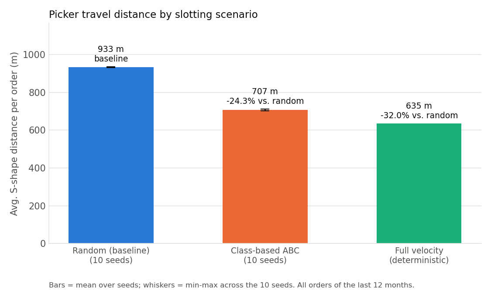
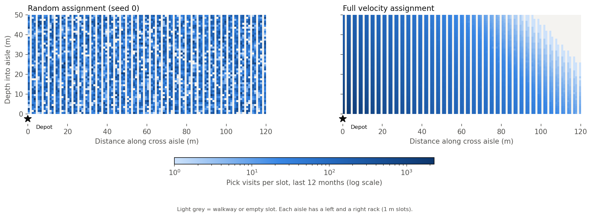
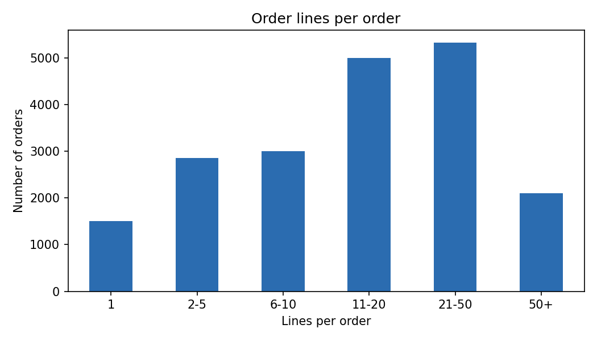
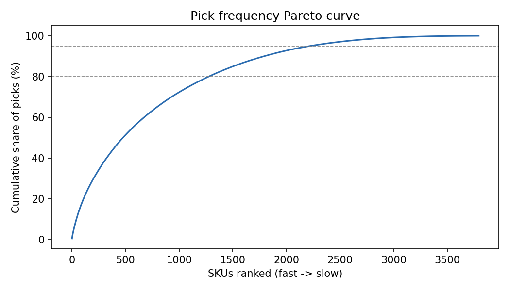

# Warehouse Slotting & Picking Optimization

> Velocity-based slotting analysis on real order data to reduce picker travel distance, with a KPI framework to measure the improvement.

  

## Business Problem

In a warehouse with thousands of SKUs, most of a picker's time is spent **walking**, not picking. If fast-moving items are stored far from the dispatch area, every order costs extra travel time and labour.

**Question:** How much can picker travel distance be reduced by re-slotting SKUs based on how often they are picked?

## Key Results

Real orders (UCI Online Retail II, last 12 months: 19,773 orders, 3,791 SKUs) routed with the S-shape heuristic through a synthetic 40-aisle warehouse.

| Scenario | Avg. distance per order | Total annual distance | Change vs. random | Est. walking time¹ | Picks from nearest 20% of slots |
|---|---|---|---|---|---|
| Random (baseline)² | 933 m | 18,449 km | – | 5,125 h | 20.2% |
| Class-based ABC² | 707 m | 13,973 km | **-24.3%** | 3,882 h | 49.9% |
| Full velocity | 635 m | 12,547 km | **-32.0%** | 3,485 h | 65.3% |

¹ Total distance at an assumed walking speed of 1.0 m/s; walking only, no picking or handling time.
² Mean of 10 random seeds. Range across seeds: random 930-936 m per order, class-based 703-711 m.

- **Class-based ABC captures about three quarters of the full-velocity saving** with only three zones, which is why it is the more practical option in a real warehouse.
- Orders are large (mean 26 lines, median 15), so picks still spread over many aisles even after re-slotting; this limits the achievable saving.
- Slotting was ranked and evaluated on the same 12 months, so these figures are an upper bound for future orders (see limitations).





Full tables: `reports/kpi_summary.xlsx` (KPI summary, assumptions, slot assignment of the 100 fastest SKUs).

### Order profile (Module 1)

- 33.6% of SKUs generate 80% of pick lines. 28.7% of SKUs land in a different ABC class by revenue than by pick frequency.
- 7.6% of orders have a single line; the median order has 15 lines.





## Approach

| # | Module | Status |
|---|---|---|
| 1 | **Order profile & velocity ABC:** lines per order, pick-frequency Pareto, ABC by pick frequency vs. ABC by revenue | ✅ Done |
| 2 | **Slotting & routing:** synthetic warehouse layout, random / class-based ABC / full-velocity slotting, S-shape picking route distance | ✅ Done |
| 3 | **KPI framework:** before/after comparison of travel distance and related warehouse KPIs in an Excel workbook | ✅ Done |

### Why pick frequency instead of revenue?
A high-revenue SKU is not necessarily a frequently picked SKU. Slotting decisions should be driven by **how many times** an item is picked, because each pick line means one trip to the location.

## Project Structure

```
warehouse-slotting-optimization/
├── data/                 # Data source & download instructions (raw and processed files not committed)
├── src/                  # Analysis scripts, run in order
├── tests/                # Unit tests for the routing distance and slotting policies
├── reports/              # kpi_summary.xlsx and figures/
├── docs/                 # Methodology notes
└── requirements.txt
```

## How to Run

```bash
pip install -r requirements.txt
# Download the dataset (see data/README.md), then run the scripts in order:
python src/01_order_profile_abc.py     # order profile, ABC classes, cleaned lines
python src/02_slotting_routing.py      # layout, 3 slotting scenarios, S-shape distances (~10 s)
python src/03_kpi_summary.py           # reports/kpi_summary.xlsx

# Tests (the S-shape distance is checked against hand-calculated routes)
python -m pytest tests/                # or: python tests/test_routing.py
```

## Assumptions & Limitations

- Order data is **real** (UCI Online Retail II); the warehouse layout is **synthetic**, since the source retailer's layout is not public. Results depend on the layout parameters (constants at the top of `src/02_slotting_routing.py`).
- Layout: 40 aisles x 2 racks x 50 slots (4,000 slots for 3,791 SKUs), 50 m aisles, 3 m aisle pitch, depot at the left end of the front cross aisle. Cross-aisle width and lateral movement inside an aisle are ignored.
- Picking routes use the S-shape heuristic, a common industry baseline rather than an optimal route. One picker per order; no batching, congestion or zone picking.
- A pick is one distinct (order, SKU) visit. Random and class-based results are averages over 10 seeds; all 19,773 orders are evaluated (no sampling).
- Walking time assumes 1.0 m/s and covers walking only; it is an indicator, not a labour-hours forecast.
- **In-sample evaluation:** SKUs are ranked with the same 12 months they are evaluated on. In an exploratory check that is not part of the scripts (rank on Dec 2010 - May 2011, evaluate on Jun - Dec 2011), the full-velocity saving was about -18% versus about -35% when ranked on the evaluation period itself. Expect a smaller saving on future orders.
- Item dimensions, weight, rack capacity, replenishment and the cost of re-slotting are not modelled.

## Author

**Oğuzhan Ketenci**, Industrial Engineering, Yıldız Technical University
[LinkedIn](https://linkedin.com/in/oguzhanketenci)
